# YearOfTheRabbit-CTF
 Year Of The Rabbit Ctf Solution

# Necessary tools

* Nmap
* Hydra
* Dirsearch
* Dirbuster

## First, we check the IP address in our browser. Then we scan for open ports with nmap.
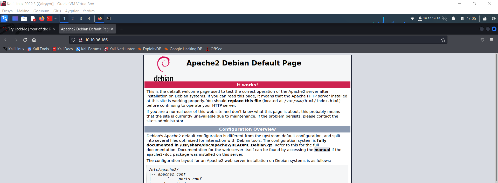

## As a result of the scan, ports 21, 22 and 80 are open
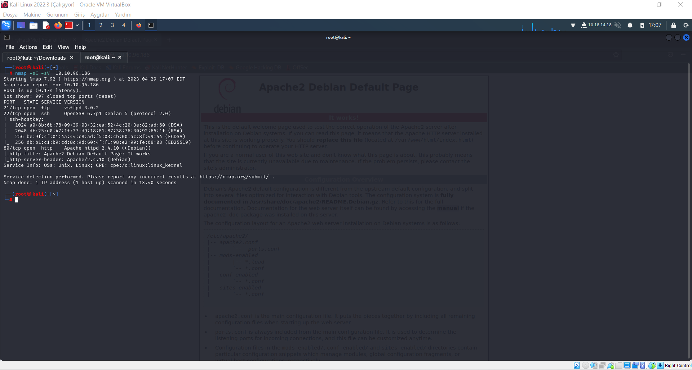

## We use our 'Dirsearch' tool because we can't find any information.
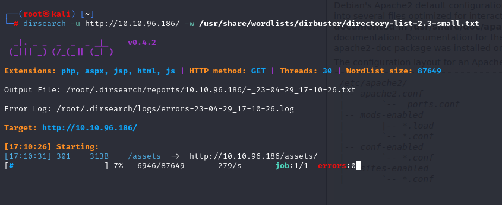

## A hidden page called 'assets' was found here. Now we go to the url it gave us in our browser.
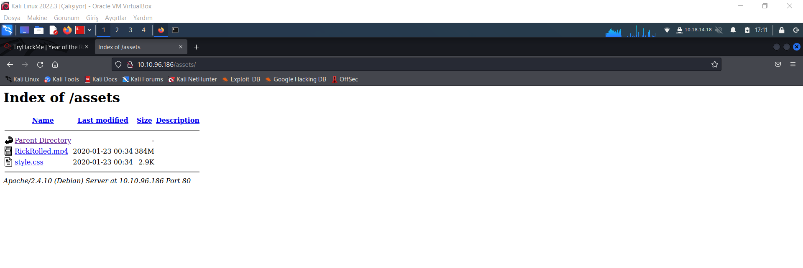

## When we enter the 'Style.css' file, we see a hidden '.php' file line. We also check from our browser and it redirects to You Tube channel.
## While redirecting, web pages are going through, now we click 'Inspect' to look at it and click on the 'Network' tab from there.
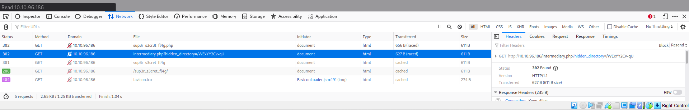

### We see that it is the username 'ftpuser'. Now, to find the password, let's save the passwords in a .txt file by saying 'nano wordlist.txt'. Now, let's try to find the password by typing the command 'hydra -l ftpuser -P wordlist.txt ftp://10.10.96.186 -V' with the 'Hydra' tool.

# Now let's try logging in via 'FTP' with username and password.
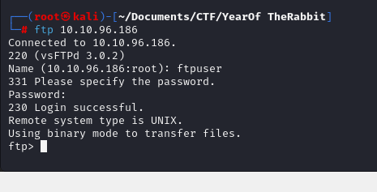

## We log in to ftp by entering the username and password via ftp. Then let's check it by saying 'ls -la'.
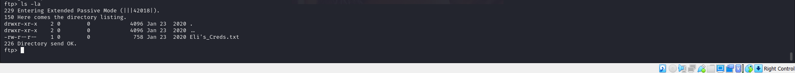

## Let's download the file named Eli's_Creds.txt to the locale by saying 'get Eli's_Creds.txt'. Now let's look at the file contents by saying 'cat Eli's_Creds.txt'.

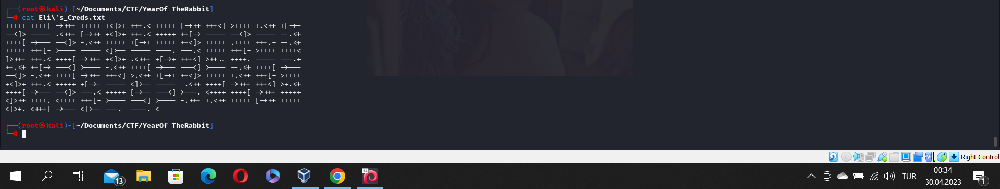

## It contains Cipher text. When we searched in which language this article was written, we learned that it was Brainfuck. Let's try to translate it by saying Brainfuck decoder in our browser.
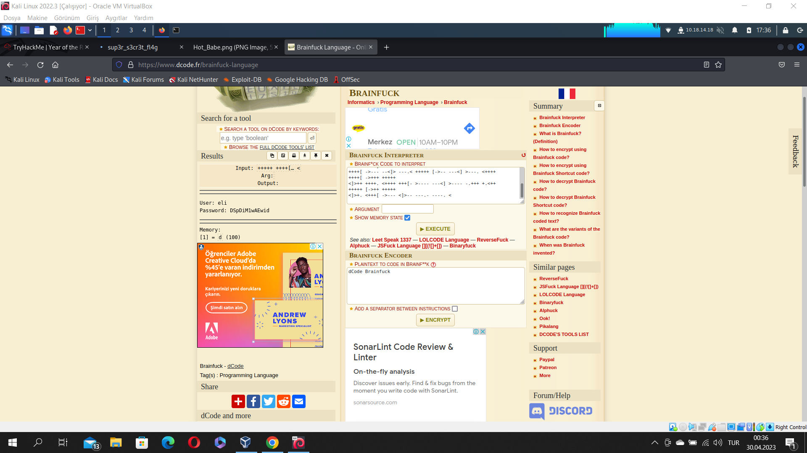

### As a result of the translation process we perform in our browser, Eli's Username and password are displayed. Then, by saying 'ssh eli@10.10.96.186', we enter ssh with the username and password as in the picture above.
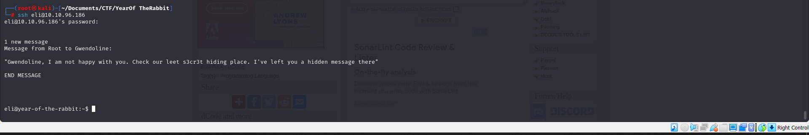

## Here we see a message and the keyword is 's3cr3t'. Let's search for such a folder by saying 'locate s3cr3t'. After the folder is found, let's go to the 's3cr3t' folder.
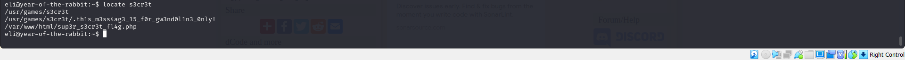

### When we logged in, he gave us the Gwendoline username and password. After logging in as Gwendoline, we see that there is a user.txt file under the gwendoline folder. We find our flag by saying 'cat user.txt'.
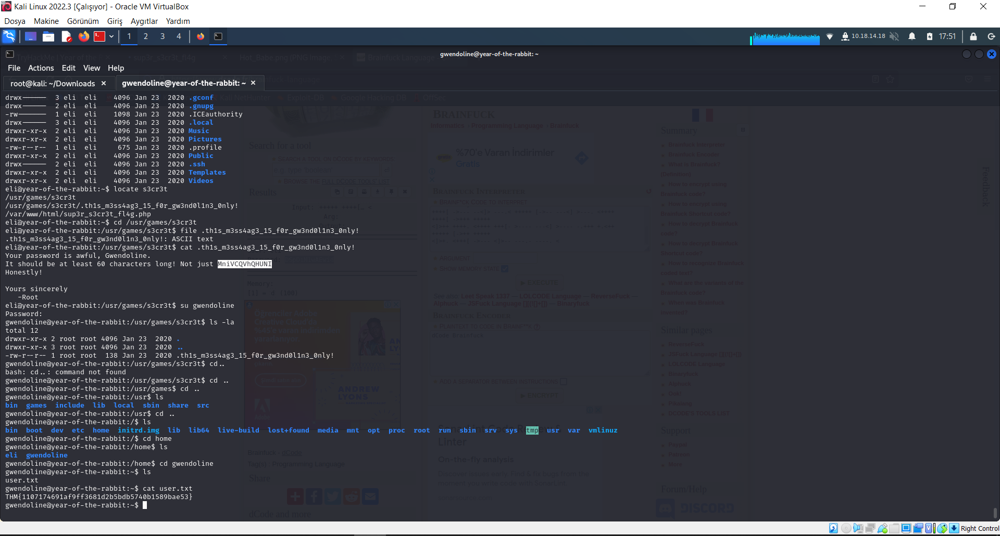

## Let's run the command 'sudo –u#-1 /usr/bin/vi /home/gwendoline/user.txt'. As a result, we see that there is a folder named root, and when we log in by saying 'cd root', there is a 'root.txt' file under the folder. Here we found our wanted Flag. Now, we looked at the file contents with the 'cat root.txt' command and caught the flag. 
# CONGRATULATIONS!!!
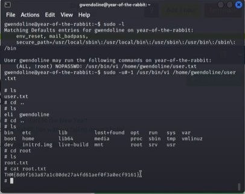
